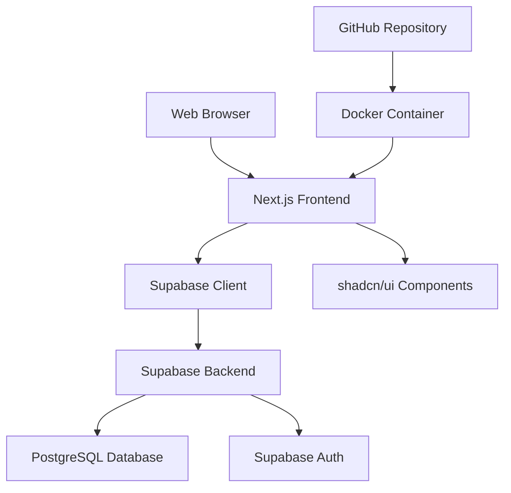

# Design Document

## Overview

The message board system is a full-stack web application built with Next.js, shadcn/ui components, and Supabase as the backend. The system provides user authentication, message publishing, search functionality, and an admin panel for content management. The application follows modern web development practices with TypeScript, responsive design, and containerized deployment.

## Architecture

### High-Level Architecture



### Technology Stack

- **Frontend Framework**: Next.js 14
- **UI Components**: shadcn/ui with Tailwind CSS
- **Backend**: Supabase (Database, Authentication, Real-time)
- **Database**: PostgreSQL (via Supabase)
- **Authentication**: Supabase Auth
- **Deployment**: Docker containerization
- **Version Control**: GitHub
- **Language**: TypeScript

## Components and Interfaces

### Frontend Components

#### Authentication Components
- `LoginForm`: Handles user login with email/password
- `RegisterForm`: Handles user registration
- `AuthGuard`: Protects routes requiring authentication
- `AdminGuard`: Protects admin-only routes

#### Message Components
- `MessageCard`: Displays individual message with all fields
- `MessageList`: Renders list of messages with pagination
- `MessageForm`: Form for creating new messages
- `SearchBar`: Search input with real-time filtering

#### Admin Components
- `AdminDashboard`: Main admin panel layout
- `AdminMessageList`: Admin view of all messages with moderation actions
- `AdminUserList`: Admin view of all users with management actions

#### Layout Components
- `Header`: Navigation with auth status and admin link
- `Footer`: Application footer
- `Layout`: Main application layout wrapper

### API Routes (Next.js)

#### Authentication Routes
- `POST /api/auth/login`: User login
- `POST /api/auth/register`: User registration
- `POST /api/auth/logout`: User logout

#### Message Routes
- `GET /api/messages`: Fetch messages with optional search
- `POST /api/messages`: Create new message
- `DELETE /api/messages/[id]`: Delete message (admin only)

#### Admin Routes
- `GET /api/admin/users`: Fetch all users (admin only)
- `PUT /api/admin/users/[id]`: Update user status (admin only)
- `GET /api/admin/messages`: Fetch all messages for moderation

### Database Schema

#### Users Table
```sql
CREATE TABLE users (
  id UUID PRIMARY KEY DEFAULT gen_random_uuid(),
  email VARCHAR(255) UNIQUE NOT NULL,
  name VARCHAR(255) NOT NULL,
  is_admin BOOLEAN DEFAULT FALSE,
  is_active BOOLEAN DEFAULT TRUE,
  created_at TIMESTAMP WITH TIME ZONE DEFAULT NOW(),
  updated_at TIMESTAMP WITH TIME ZONE DEFAULT NOW()
);
```

#### Messages Table
```sql
CREATE TABLE messages (
  id UUID PRIMARY KEY DEFAULT gen_random_uuid(),
  title VARCHAR(255) NOT NULL,
  description TEXT NOT NULL,
  publisher_name VARCHAR(255) NOT NULL,
  contact_phone VARCHAR(20) NOT NULL,
  user_id UUID REFERENCES users(id) ON DELETE CASCADE,
  created_at TIMESTAMP WITH TIME ZONE DEFAULT NOW(),
  updated_at TIMESTAMP WITH TIME ZONE DEFAULT NOW()
);
```

## Data Models

### User Model
```typescript
interface User {
  id: string;
  email: string;
  name: string;
  isAdmin: boolean;
  isActive: boolean;
  createdAt: Date;
  updatedAt: Date;
}
```

### Message Model
```typescript
interface Message {
  id: string;
  title: string;
  description: string;
  publisherName: string;
  contactPhone: string;
  userId: string;
  createdAt: Date;
  updatedAt: Date;
}
```

### Form Validation Models
```typescript
interface LoginForm {
  email: string;
  password: string;
}

interface RegisterForm {
  email: string;
  password: string;
  name: string;
}

interface MessageForm {
  title: string;
  description: string;
  contactPhone: string;
}
```

## Error Handling

### Frontend Error Handling
- **Form Validation**: Real-time validation using react-hook-form with zod schemas
- **API Errors**: Centralized error handling with toast notifications
- **Authentication Errors**: Redirect to login with error messages
- **Network Errors**: Retry mechanisms and offline indicators

### Backend Error Handling
- **Database Errors**: Proper error codes and user-friendly messages
- **Authentication Errors**: Secure error responses without exposing sensitive info
- **Validation Errors**: Detailed field-level error messages
- **Authorization Errors**: Clear access denied messages

### Error Types
```typescript
interface ApiError {
  code: string;
  message: string;
  field?: string;
}

interface ValidationError {
  field: string;
  message: string;
}
```

## Testing Strategy

### Unit Testing
- **Components**: Test rendering, user interactions, and prop handling
- **Utilities**: Test validation functions, formatters, and helpers
- **API Routes**: Test request/response handling and error cases
- **Database Operations**: Test CRUD operations and constraints

### Integration Testing
- **Authentication Flow**: Test login, registration, and session management
- **Message Operations**: Test create, read, search functionality
- **Admin Operations**: Test user and message management
- **Database Integration**: Test Supabase client operations

### End-to-End Testing
- **User Journeys**: Test complete user workflows
- **Admin Workflows**: Test admin panel functionality
- **Cross-browser Testing**: Ensure compatibility across browsers
- **Mobile Responsiveness**: Test on various screen sizes

### Testing Tools
- **Unit/Integration**: Jest + React Testing Library
- **E2E**: Playwright or Cypress
- **Database**: Supabase test environment
- **Mocking**: MSW for API mocking

## Security Considerations

### Authentication Security
- **Password Hashing**: Handled by Supabase Auth
- **Session Management**: Secure JWT tokens with proper expiration
- **CSRF Protection**: Built-in Next.js CSRF protection
- **Rate Limiting**: Implement rate limiting on auth endpoints

### Data Security
- **Input Validation**: Server-side validation for all inputs
- **SQL Injection**: Protected by Supabase's parameterized queries
- **XSS Prevention**: React's built-in XSS protection + content sanitization
- **Admin Access**: Role-based access control with proper authorization checks

### Privacy
- **Data Minimization**: Only collect necessary user information
- **Contact Information**: Validate and sanitize phone numbers
- **User Consent**: Clear terms for data usage

## Performance Optimization

### Frontend Performance
- **Code Splitting**: Next.js automatic code splitting
- **Image Optimization**: Next.js Image component
- **Caching**: Browser caching for static assets
- **Bundle Size**: Tree shaking and dynamic imports

### Backend Performance
- **Database Indexing**: Proper indexes on search fields
- **Query Optimization**: Efficient Supabase queries
- **Pagination**: Implement pagination for message lists
- **Real-time Updates**: Supabase real-time subscriptions for live updates

### Deployment Performance
- **Docker Optimization**: Multi-stage builds for smaller images
- **CDN**: Static asset delivery via CDN
- **Compression**: Gzip compression for responses